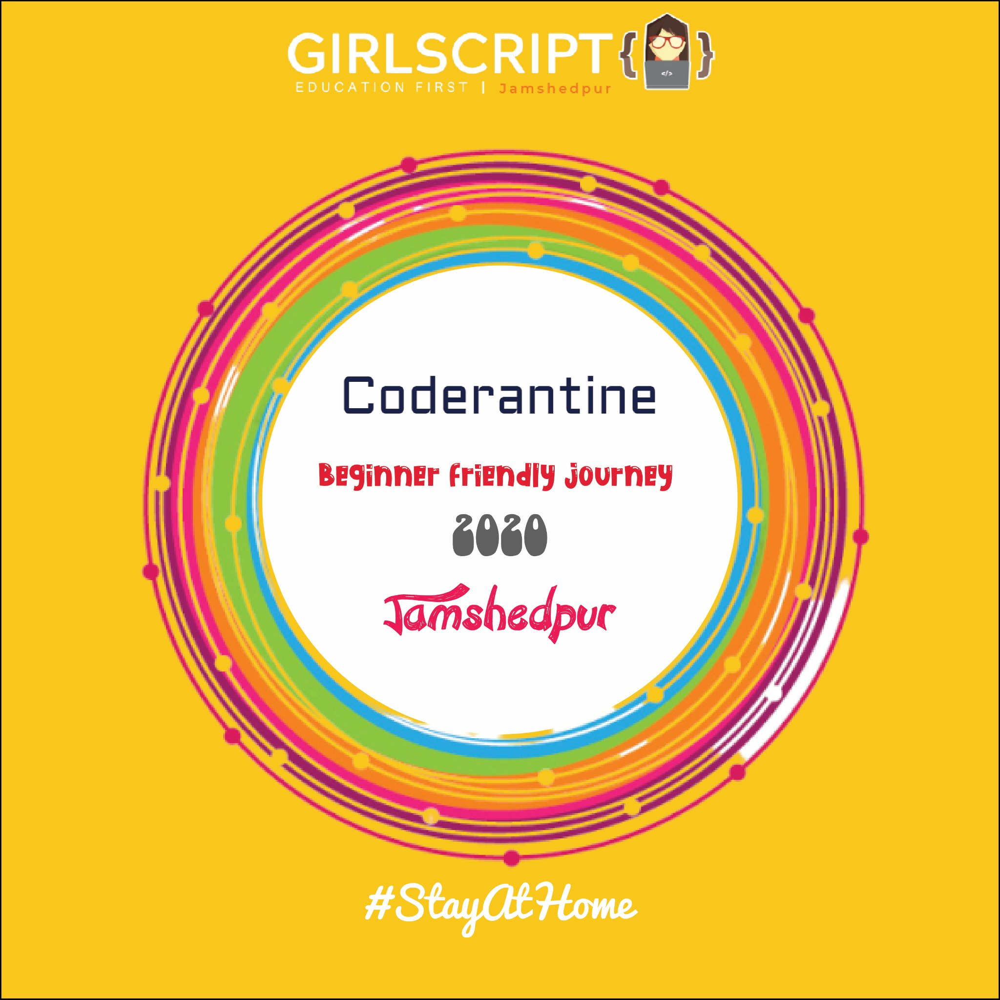

# Coderantine : C++ Programming
This is a 7 day crash course of C++ Programming which will cover almost all the basics required to kickstart C++ programming.

## Course Structure
DAY | Topics Covered 
--- | --- 
1 | Introduction to C++ programming, Input , Output 
2 | Data Types and Operators 
3 | Control statements 
4 | Functions
5 | Structure and Class
6 | Introduction to Competitive Programming
7 | Session by Guest Speaker 
